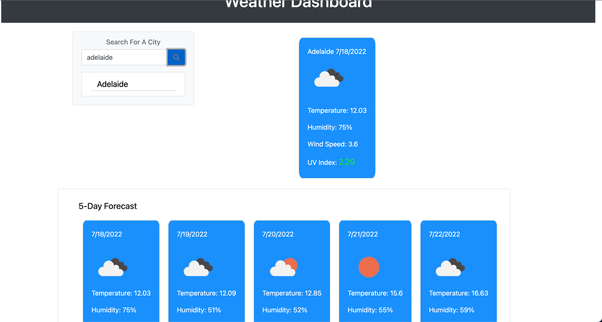
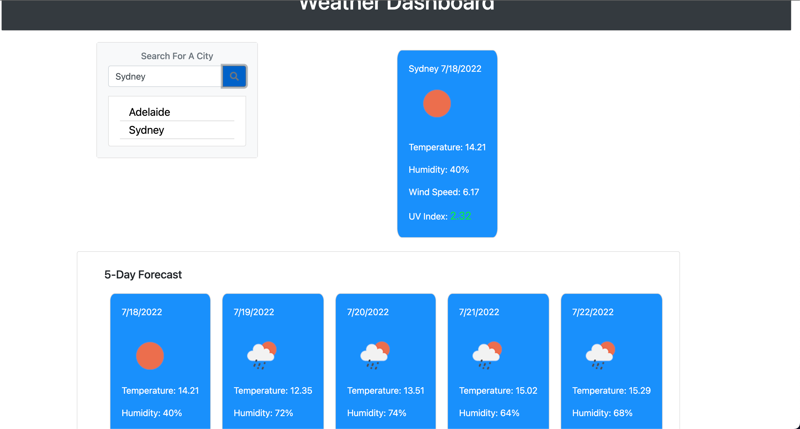

### Weather_Forecast_App
Week 6 Challenge

* ['Weather-Dashboard - Github'](https://github.com/tajdinov/Weather_Forecast_App)
* ['Weather-Dashboard - Github IO'](https://tajdinov.github.io/Weather_Forecast_App/)

### Summary
* HTML and CSS and Javascript documents create a weather application 
* This project emphasizes the use of using an API call and JQuery to make dynamic changes to an HMTL document
* This project utilizes the use of appending HTML pages 

### This project has the following features: 
* A Search bar for the city location
* A card that provides the current weather
    ** Location, Temp, Humidity, Wind Speed, UV Index 
* A Card that provides a five day forecast  

### Psuedo code:  
* Create a search input for customer input 
* 3 API calls for Current Weather, 5-day Forecast and UV Index
* 3 Separate cards with search history, current weather and 5-day weather
* Local storage will save user history 
* .empty() will clear old info before new info is populated 

### This project has script features of:
* 3 API calls
* Variable declaration area 
* An event listener (onclick) that recieves user input
* A ForEach to loop through the 5-day forecast 

### To Execute File:
> Open in browser

### Features: 
* One HTML Pages
    * Index.html 
        * Contains Search bar and placeholder divs for content
* One CSS Page
    * Styles.css
        * Adds formatting to 5-day forecast and cards 
* One Javascript Page
        * Contains: 
        * Variables, including array
        * Event listeners
        * For each loop
        * Local Storage set and get 

